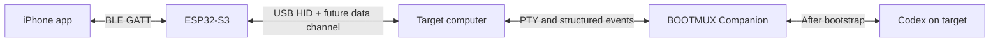

# BOOTMUX

**BOOTMUX creates the first physical and software path for AI into a computer that is not ready to run AI yet.**

It combines an iPhone, an ESP32-S3, USB HID, BLE, a terminal bridge, and a target-side Codex runtime.

> The first path for AI into any computer.

## Current build target — Hackathon V1

The immediate target is intentionally narrow:

1. enter keyboard text from an iPhone through BLE and ESP32-S3 USB HID;
2. install and reach Codex in a clean target environment;
3. return live terminal text to the iPhone and make it selectable and copyable.

```text
Input:
iPhone
→ BLE
→ ESP32-S3
→ USB HID keyboard
→ target

Output:
target PTY
→ BOOTMUX Companion
→ local WebSocket
→ iPhone terminal view
```

The asymmetric return path is deliberate. Full terminal return through USB and ESP32-S3 is deferred to V1.1 so the first end-to-end proof remains small and repeatable.

The final V1 demonstration asks Codex to return:

```text
BOOTMUX_READY
```

V1 is complete when that marker reaches the iPhone and can be selected, copied, and pasted using native iOS behavior.

Read [Hackathon V1](docs/HACKATHON_V1.md) for the exact boundary and [Roadmap](docs/ROADMAP.md) for the V0–V4 implementation gates.

## OpenAI Build Week compliance

BOOTMUX treats submission compliance as a parallel delivery path rather than a final checklist.

```text
Technical gates:
V0 → V1 → V2 → V3 → V4

Submission gates:
BW0 → BW1 → BW2 → BW3 → BW4 → BW5 → BW6 → BW7 → BW8 → BW9
```

The official-source summary is maintained in [OpenAI Build Week Requirements](docs/OPENAI_BUILD_WEEK.md). The executable submission sequence is maintained in the [Build Week Submission Roadmap](docs/BUILD_WEEK_SUBMISSION_ROADMAP.md).

Mandatory submission evidence includes:

- meaningful Codex and GPT-5.6 use;
- a `/feedback` Session ID from the primary Codex build thread;
- a public YouTube demo of three minutes or less with voice narration;
- setup, supported-platform, and judge-test instructions;
- a public repository with relevant licensing, or the required private judge sharing;
- explicit separation of pre-existing work and Submission Period work.

Current submission blockers include implementation of V0–V4, selection of a public-repository license, capture of the private `/feedback` Session ID, creation of a no-rebuild judge test path, and production of the narrated demo video.

## V1 implementation strategy

Hackathon V1 minimizes code, dependencies, and runtime layers.

- prefer platform-native phone capabilities;
- use the vendor-supported embedded stack for BLE and USB HID;
- deploy Companion as one small executable or equivalent minimal bundle;
- send committed command text in batches instead of one BLE transaction per character;
- send terminal output in bounded batches instead of one frame per byte;
- use selectable plain text instead of a complete terminal emulator;
- prefer a bounded one-shot Codex invocation for the final connectivity proof;
- prefer the smallest supported official Codex distribution;
- keep initial protocols readable and versioned;
- defer compression, advanced codecs, local models, and research transports until measurements justify them.

The public architecture names capabilities rather than optional third-party packages. Concrete implementation dependencies may be selected later, pinned in build metadata, and disclosed in attribution files.

## Project status

BOOTMUX has completed and locally verified the V0A target-side Companion core. The iPhone, BLE, native USB HID, Codex bootstrap, and full hardware loop remain under active development. The first test environment is a minimal ARM64 Linux virtual machine hosted on a single Apple Silicon Mac, alongside a physical iPhone and ESP32-S3.

The V0B iPhone Terminal Loop implementation is now present under `iphone/`. It is a dependency-free SwiftUI app using `URLSessionWebSocketTask` and a selectable `UITextView` bridge. Physical iPhone, signing, and Simulator evidence remain pending because the current implementation environment has no Xcode/iOS SDK or connected test device.

No runtime, hardware, benchmark, novelty, or Build Week compliance claim is considered complete until reproducible evidence exists.

## Build Week Scope

The current Build Week delivery spine is documented in [Build Week Status](docs/submission/BUILD_WEEK_STATUS.md), [Build Week Scope Ledger](docs/submission/BUILD_WEEK_SCOPE_LEDGER.md), and [Claim Evidence Matrix](docs/submission/CLAIM_EVIDENCE_MATRIX.md). V0A is complete; V0B through V4 and the human-confirmation submission gates remain open or blocked as recorded there.

## How Codex Was Used

Codex was used in V0A and V0B implementation work. The current Codex thread is the confirmed Primary Build Thread for the continuing core work. The public repository records the resulting code, tests, repair history, and claim boundary; no real `/feedback` Session ID is published here.

## How GPT-5.6 Was Used

GPT-5.6 contributed to the asymmetric transport architecture, the V0A implementation contract, V0A R1–R3 edge-case review, public claim-safety boundary, and Devpost short-copy/story structure. Concrete results and commit mappings are recorded in [Codex and GPT-5.6 Evidence Ledger](docs/submission/CODEX_GPT56_EVIDENCE_LEDGER.md).

## Human Decisions

Human decisions set the product direction, selected the V0A scope, retained the iPhone/BLE/ESP32-S3 roadmap boundary, accepted implementation fixes, and remain responsible for registration, license selection, final claims, video, and submission.

## Third-Party and Pre-Existing Work

Pre-existing concept and exploratory architecture are separated from submission-period implementation in the [Build Week Scope Ledger](docs/submission/BUILD_WEEK_SCOPE_LEDGER.md). Third-party dependencies and their licenses are treated as implementation details until the repository owner selects the submission license. No repository license has been added yet.

## Installation

V0A is a local development Companion proof and is not yet a packaged cross-platform installation. See `companion/README.md` for the current local build and probe commands.

For the V0B app, open `iphone/BOOTMUX.xcodeproj` in Xcode with an iOS SDK. Start the Companion on a trusted local network with `go run . -addr 0.0.0.0:8765 -allow-remote`, then enter the resulting `ws://<trusted-local-host>:8765/v1/terminal` endpoint in the app. No signing material or external iPhone runtime dependency is committed.

## Supported Platforms

The verified V0A environment is the declared Unix-like local target used by the Companion tests. V0B targets iOS 17 or later but has not yet received Simulator or physical-device validation. ESP32-S3 firmware, BLE, and native USB HID support are not implemented or proven.

## Judge Test Mode

No final judge test mode is available yet. The local probe demonstrates only the target-side Companion path, and the V0B app remains physical-device-unverified.

## How to Run Hardware Demo

There is no complete hardware demo to run yet. The future demo must separately prove iPhone input, BLE, ESP32-S3 USB HID, terminal return, and Codex bootstrap; the current claim boundary is maintained in the [Claim Evidence Matrix](docs/submission/CLAIM_EVIDENCE_MATRIX.md).

## Full architecture



The long-term system advances through three stages:

1. **Input path:** ESP32-S3 appears as a USB mouse and keyboard.
2. **Terminal path:** BOOTMUX Companion opens a live PTY and returns stdout, stderr, and exit status.
3. **Agent path:** Codex is installed on the target and takes over repository-scale work.

Hackathon V1 proves only the smallest keyboard, Codex, and copyable-terminal slice of that architecture.

## Future product surfaces

- **PAD:** full-screen trackpad with a collapsible system keyboard.
- **TERMINAL:** selectable live terminal with an embedded AI diagnosis panel.
- **AI:** conversation, runtime selection, approvals, and recovery status.
- **BRIDGE:** ESP32-S3 firmware for BLE, USB HID, transport switching, and compact state storage.
- **COMPANION:** target-side PTY bridge and structured executor.
- **CAPSULE:** redacted state, proposed action, evidence, and resume data.

These surfaces are not all required for Hackathon V1.

## SAI-originated research program

BOOTMUX includes an experimental lightweight recovery architecture proposed by **SAI (宰)** during project design.

Its central thesis is:

> **Convert machine uncertainty into the smallest safe set of proof-bearing observations and executions required to advance recovery.**

The research program includes EPOCHROOT, TTYRETINA, Proof Frontier Execution, SYNDROMUX, SYNDCOMP, VOIDCODE, CAUSALCLOCK, STRATAROOT, ROOTFIT, and effect-bounded experiment mechanisms.

These are documented research hypotheses, not completed V1 dependencies and not claims that every underlying foundation was invented by BOOTMUX.

Read [SAI Research Hypotheses](docs/SAI_RESEARCH_HYPOTHESES.md) and the independent [SAI Research Roadmap](docs/SAI_RESEARCH_ROADMAP.md). Research work begins after V1 or in isolated fixtures that cannot delay V0–V4 or BW0–BW9.

## Safety model

BOOTMUX does not grant an AI unrestricted shell access.

For Hackathon V1:

- authentication remains user-controlled;
- no credential is included in fixtures, logs, or recordings;
- terminal output is bounded;
- sent HID input is not presented as verified target output;
- failures remain visible and cannot become false completion claims;
- the WebSocket return path is described honestly as a development path;
- the real `/feedback` Session ID remains outside the public repository by default.

For the full architecture, a deterministic policy gate, structured execution, explicit approval, evidence verification, and abstention remain part of the post-V1 roadmap.

See [Architecture](docs/ARCHITECTURE.md), [Hackathon V1](docs/HACKATHON_V1.md), [Roadmap](docs/ROADMAP.md), [OpenAI Build Week Requirements](docs/OPENAI_BUILD_WEEK.md), [Build Week Submission Roadmap](docs/BUILD_WEEK_SUBMISSION_ROADMAP.md), [SAI Research Hypotheses](docs/SAI_RESEARCH_HYPOTHESES.md), [SAI Research Roadmap](docs/SAI_RESEARCH_ROADMAP.md), [Publication Safety](docs/PUBLICATION_SAFETY.md), and [Security](SECURITY.md).

## Repository policy

This public repository must not contain credentials, personal contact information, private infrastructure names, local absolute paths, raw production logs, private network addresses, device identifiers, or private submission credentials. Use synthetic examples and placeholders in all documentation, tests, fixtures, screenshots, and demos.

## License

No license has been selected yet. Until one is added, normal copyright restrictions apply. A relevant license is a mandatory blocker before using this public repository for the Build Week submission route.
