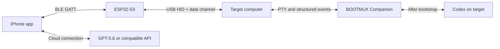

# BOOTMUX

**BOOTMUX creates the first physical and software path for AI into a computer that is not ready to run AI yet.**

It combines an iPhone, an ESP32-S3, USB HID, BLE, a terminal bridge, and policy-gated AI recovery to bootstrap a target computer from basic input control to a live terminal and, eventually, a local Codex runtime.

> The first path for AI into any computer.

## Project status

BOOTMUX is in the architecture and proof-of-concept stage. The first implementation target is a narrowly scoped macOS or Linux demonstration. Windows support, power-control hardware, and application-specific cellular relays are later research tracks.

No runtime, hardware, benchmark, or novelty claim is considered complete until reproducible evidence is committed.

## Core flow

The system advances through three stages:

1. **Input path:** ESP32-S3 appears as a USB mouse and keyboard.
2. **Terminal path:** BOOTMUX Companion opens a live PTY and returns stdout, stderr, and exit status.
3. **Agent path:** Codex is installed on the target and takes over repository-scale work.

## Product surfaces

- **PAD:** full-screen trackpad with a collapsible system keyboard.
- **TERMINAL:** selectable live terminal with an embedded AI diagnosis panel.
- **AI:** conversation, runtime selection, approvals, and recovery status.
- **BRIDGE:** ESP32-S3 firmware for BLE, USB HID, transport switching, and compact state storage.
- **COMPANION:** target-side PTY bridge and structured executor.
- **CAPSULE:** redacted state, proposed action, evidence, and resume data.

## SAI-originated research program

BOOTMUX includes an experimental lightweight recovery architecture proposed by **SAI (宰)** during project design.

Its central thesis is:

> **Convert machine uncertainty into the smallest safe set of proof-bearing observations and executions required to advance recovery.**

The research program includes:

- **EPOCHROOT:** state-rooted sparse transport and execution;
- **TTYRETINA:** semantic terminal events with bounded raw fallback;
- **Proof Frontier Execution:** recovery as explicit missing proof obligations;
- **SYNDROMUX:** compact, rateless diagnostic syndromes;
- **SYNDCOMP:** runtime compilation of safety-constrained probe programs;
- **VOIDCODE:** explicit abstention regions for unknown incidents;
- **CAUSALCLOCK:** mutation-indexed evidence validity;
- **STRATAROOT:** volatility-separated hierarchical state roots;
- **ROOTFIT:** proof-carrying reuse of compiled diagnostic artifacts;
- **Effect-Bounded Experiment Cells and Counterfactual Effect Receipts:** bounded experimentation without confusing simulated and committed effects.

These are openly documented research hypotheses, not claims that every underlying foundation was invented by BOOTMUX or that the system has already been validated.

Read [SAI Research Hypotheses](docs/SAI_RESEARCH_HYPOTHESES.md) for definitions, attribution, safety boundaries, evaluation, and falsification criteria. The independent [SAI Research Roadmap](docs/SAI_RESEARCH_ROADMAP.md) defines the H0–H8 evidence gates used to move each hypothesis through `CONCEPT`, `SPECIFIED`, `PROTOTYPED`, `MEASURED`, and ultimately `SUPPORTED`, `REVISE`, or `REJECTED` without blocking the core product path.

## Safety model

BOOTMUX does not grant an AI unrestricted shell access. A deterministic policy gate sits outside the model.

- Read-only probes may be eligible for automatic execution.
- Package installation, file mutation, service changes, elevated privileges, and authentication require approval.
- Disk initialization, unrestricted recursive deletion, credential export, security disabling, self-approval, and policy modification are denied by default.
- Structured executable-and-argument calls are preferred over shell interpolation.
- Success is determined from machine-generated evidence rather than an AI assertion.
- Insufficient or contradictory evidence must produce abstention rather than a forced repair classification.
- Counterfactual experiment results must never be labeled as committed production evidence.

See [Architecture](docs/ARCHITECTURE.md), [Core Roadmap](docs/ROADMAP.md), [SAI Research Hypotheses](docs/SAI_RESEARCH_HYPOTHESES.md), [SAI Research Roadmap](docs/SAI_RESEARCH_ROADMAP.md), [Publication Safety](docs/PUBLICATION_SAFETY.md), and [Security](SECURITY.md).

## Repository policy

This public repository must not contain credentials, personal contact information, private infrastructure names, local absolute paths, raw production logs, private network addresses, or device identifiers. Use synthetic examples and placeholders in all documentation, tests, fixtures, screenshots, and demos.

## License

No license has been selected yet. Until one is added, normal copyright restrictions apply.
