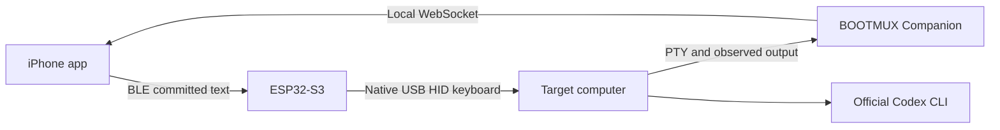

# BOOTMUX

**The physical first mile for Codex.**

> Built by Codex. Architected and hardened with GPT-5.6. Proven through human-operated hardware.

BOOTMUX gives an iPhone a bounded physical path into a computer before the normal AI, SSH, or remote-development path is ready. Committed text travels through Bluetooth Low Energy and an ESP32-S3 that appears to the target as a native USB HID keyboard. Independently observed terminal and Codex output returns through a target-side Companion to the iPhone.

## Demo video

[Watch the public narrated BOOTMUX demo on YouTube](https://www.youtube.com/watch?v=BNWTRxrVM6M).

## Quick judge test — no build required

1. Download or clone this repository.
2. Open [`judge/index.html`](judge/index.html) directly in a modern browser.
3. Select **Replay BOOTMUX_READY**.
4. Confirm that the observed terminal text is selectable and copyable using native browser behavior.

The standalone replay requires no account, credential, network connection, private endpoint, executable, or hardware. It demonstrates the terminal, session, selection, and copy experience; it does **not** claim to reproduce the physical BLE or USB HID path.

For the packaged macOS arm64 and live Companion paths, follow [Judge Mode instructions](judge/README.md).

## What was demonstrated

| Slice | Current evidence boundary |
| --- | --- |
| Companion | Go PTY/WebSocket terminal core with bounded queues, batching, cleanup, and fail-closed behavior |
| iPhone client | Native SwiftUI/CoreBluetooth implementation for BLE input and bounded terminal output |
| Physical input | Owner-observed bounded ASCII path: iPhone → BLE → ESP32-S3 → native USB HID → target |
| Codex return | A real target-side Codex prompt returned the exact marker `BOOTMUX_READY` to the iPhone |
| Clean target | Official Codex CLI installation and bounded probes passed in a clean ARM64 Lima VM |
| Judge path | Standalone offline replay plus packaged and live local Judge Mode |

The canonical public narrative is [BOOTMUX Project Story](docs/PROJECT_STORY.md). Exact claim boundaries are maintained in the [Claim and Evidence Matrix](docs/submission/CLAIM_EVIDENCE_MATRIX.md).

## Why BOOTMUX exists

When a target computer is new, damaged, offline from the normal development path, or not yet configured, the usual advice—install a tool, open SSH, paste a command—may be impossible to follow. BOOTMUX is designed for that earlier bootstrap moment.

It is intentionally **not just an SSH client**. SSH assumes the target is already reachable and configured. BOOTMUX begins with a physical keyboard interface the target already understands.

## Architecture

BOOTMUX separates sent input from independently observed output so a successful bridge acknowledgement is never mistaken for proof that the target processed a command.

```text
Physical input:
iPhone
→ Bluetooth Low Energy
→ ESP32-S3
→ native USB HID keyboard
→ target computer

Observed return:
target PTY / Codex
→ BOOTMUX Companion
→ local WebSocket
→ iPhone terminal
```



## Repository map

| Path | Purpose |
| --- | --- |
| [`iphone/`](iphone/) | Native iOS 17+ SwiftUI and CoreBluetooth client |
| [`firmware/esp32s3-bridge/`](firmware/esp32s3-bridge/) | Bounded BLE-to-native-USB-HID bridge firmware |
| [`companion/`](companion/) | Go PTY/WebSocket Companion and bounded Codex adapter |
| [`vm/`](vm/) | Clean ARM64 Lima VM creation, provisioning, and demo harness |
| [`judge/`](judge/) | No-build offline Judge Replay |
| [`dist/bootmux-judge-macos-arm64/`](dist/bootmux-judge-macos-arm64/) | Packaged macOS arm64 Judge Mode |
| [`docs/evidence/`](docs/evidence/) | Public-safe technical and physical evidence records |
| [`docs/submission/`](docs/submission/) | Build Week scope, claims, tool-use evidence, and submission records |

## Run the live Companion

Requirements: a Unix-like environment and Go.

```sh
cd companion
go test ./...
go run . -addr 127.0.0.1:8765
```

Then open:

```text
http://127.0.0.1:8765/judge
```

Choose **Connect live Companion**. The listener is loopback-only by default. Non-loopback binding requires the explicit `-allow-remote` flag and a trusted external network boundary.

More details: [Companion README](companion/README.md) and [protocol documentation](docs/COMPANION_PROTOCOL_V1.md).

## Run the iPhone client

Requirements: Xcode with an iOS SDK and iOS 17 or later.

1. Open `iphone/BOOTMUX.xcodeproj`.
2. Build for an available simulator or locally signed device.
3. Start the Companion on a trusted local network when using the live terminal path.
4. Enter the versioned WebSocket endpoint in the app.

The physical bridge additionally requires an ESP32-S3 board with native USB device support and the firmware under `firmware/esp32s3-bridge/`.

## How Codex was used

Codex was the implementation and execution engine. It implemented and repaired the Go Companion, native SwiftUI client, ESP32-S3 firmware, ARM64 VM harness, bounded Codex adapter, Judge Mode, tests, probes, and validation tooling. It operated on the real repository, ran builds and tests, inspected concrete failures, and returned evidence for review.

The Primary Build Thread was confirmed and its `/feedback` Session ID was captured privately. The real ID is intentionally not stored in this public repository.

## How GPT-5.6 was used

GPT-5.6 was the architecture, adversarial-review, and convergence layer. It converted the human product goal into bounded contracts, separated physical input from independently observed output, constrained scope, reviewed lifecycle and overflow behavior, identified the BLE queue-ownership hazard, audited HID Mirror path binding, and protected the distinction between code-green and physically proven claims.

The repeated development loop was:

```text
Human goal and END condition
→ GPT-5.6 decomposition, contracts, risk review, and scope control
→ Codex implementation, execution, tests, and evidence
→ GPT-5.6 review of code, failures, and proof boundaries
→ bounded repair instructions
→ Codex repair and re-validation
→ human physical acceptance or an explicit unresolved gate
```

Concrete examples and commit mappings are recorded in the [Codex and GPT-5.6 Evidence Ledger](docs/submission/CODEX_GPT56_EVIDENCE_LEDGER.md).

## Supported platforms

- **Standalone Judge Replay:** modern browser on macOS, Windows, or Linux
- **Packaged Judge Mode:** macOS arm64
- **Companion development path:** verified Unix-like environment and clean ARM64 Lima VM
- **iPhone client:** iOS 17 or later
- **Physical bridge:** ESP32-S3 with BLE and native USB HID keyboard support

## Evidence boundary

Demonstrated or owner-observed in the Build Week slice:

- Go PTY/WebSocket Companion;
- native SwiftUI iPhone implementation;
- bounded BLE transport and native USB HID ASCII delivery;
- official Codex installation and bounded probes in a clean ARM64 VM;
- physical `BOOTMUX_READY` return to the iPhone;
- standalone and packaged Judge Mode.

Not claimed as complete:

- production-ready or repeatable physical operation;
- Unicode HID or mouse support;
- full terminal emulation;
- completely offline target operation;
- continued post-bootstrap operation;
- physical selectable-copy, visible CLEAR, or HID Mirror acceptance until owner-confirmed.

## Build Week submission state

The public narrated demo is available on YouTube, the Developer Tools entry was submitted on Devpost before the deadline, and the private `/feedback` Session ID was entered in the form. The repository, MIT license, setup instructions, supported-platform details, and no-build Judge Mode remain available for judging.

See [Build Week Status](docs/submission/BUILD_WEEK_STATUS.md) and [Final Checklist](docs/submission/FINAL_CHECKLIST.md) for the public-safe closeout record.

## Security and privacy

Do not commit credentials, private endpoints, signing material, device identifiers, local account paths, or the real `/feedback` Session ID. Local Wi-Fi credentials remain outside the repository under the documented [local secret contract](docs/evidence/LOCAL_WIFI_SECRET.md).

See [Security Policy](SECURITY.md) and [Publication Safety](docs/PUBLICATION_SAFETY.md).

## License

BOOTMUX is available under the [MIT License](LICENSE).
