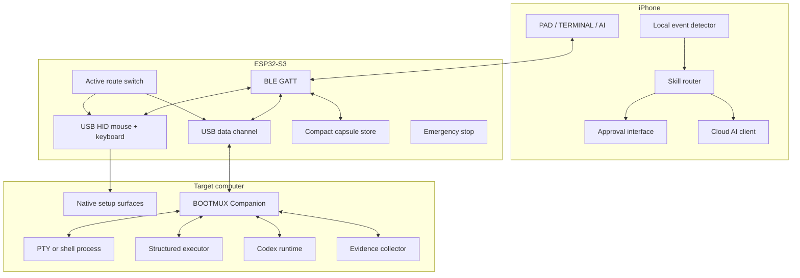
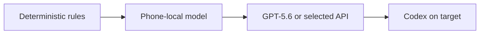

# BOOTMUX Architecture Blueprint

## 1. Purpose

BOOTMUX is a portable out-of-band bootstrap and recovery interface. It is designed for a target computer that may initially lack one or more of the following:

- a configured network path;
- remote administration software;
- a usable AI runtime;
- a terminal bridge;
- a working developer environment;
- Codex or an equivalent target-side agent.

The core research question is:

> Can an AI create the communication path, runtime, and verification system required to deploy a stronger agent onto a computer that could not use AI before?

BOOTMUX answers this with a staged system rather than assuming full remote access already exists.

## 2. Design principles

1. **Physical access before software access.** USB HID provides the first dependable input path.
2. **Progressive capability.** The system moves from input, to terminal, to target-side agent.
3. **Observation may be automatic; mutation is policy-gated.**
4. **Evidence defines success.** The target machine returns receipts for important state transitions.
5. **Bandwidth is treated as scarce.** Send compact diagnostic capsules rather than unrestricted logs.
6. **Resume from verified state.** Avoid repeating installs or destructive operations after interruption.
7. **Public-by-default documentation.** Examples must be synthetic and free of personal or infrastructure-specific information.

## 3. System context



## 4. Capability stages

### Stage 0 — Input bootstrap

The target has no BOOTMUX software.

Available:

- USB HID pointer and keyboard input;
- BLE control from the iPhone;
- synthetic local console showing commands and sent actions;
- deterministic setup state;
- emergency stop.

Unavailable:

- trusted stdout or stderr;
- exit status;
- target filesystem inspection;
- verified command completion.

The Stage 0 display must never present sent keystrokes as confirmed shell output.

### Stage 1 — Live terminal

BOOTMUX Companion has started on the target.

Available:

- PTY input and output;
- stdout and stderr framing;
- process lifecycle and exit status;
- working-directory and environment metadata;
- exact Unicode insertion through a controlled companion operation;
- structured read-only probes;
- evidence receipts.

### Stage 2 — Target-side agent

Codex has been installed and authenticated on the target.

Available:

- structured agent events;
- repository inspection and editing;
- test and build execution;
- approval requests;
- target-side long-running work;
- handoff from phone-side reasoning to target-side Codex.

The iPhone remains the user interface and approval boundary even when the runtime changes.

## 5. iPhone application

The application has exactly three primary tabs.

### PAD

- full-screen trackpad;
- one-finger pointer movement and click;
- two-finger scrolling and secondary click;
- long-press drag;
- collapsible system keyboard;
- visible connection and stop status.

### TERMINAL

- selectable, copyable terminal text using native iOS behavior;
- resizable AI diagnosis panel below the terminal;
- automatic event classification;
- no custom “send terminal to AI” requirement;
- explicit approval and rejection controls only when an action is proposed.

### AI

- conversation history;
- runtime selector: `AUTO`, `LOCAL`, `CLOUD`, `NIM`, `CODEX`;
- current machine stage;
- pending approval;
- capsule and evidence summaries;
- clear stop and disconnect controls.

The system keyboard submits committed Unicode text. Arbitrary Unicode insertion is handled by Companion after Stage 1; Stage 0 HID input may be limited by the target keyboard layout.

## 6. ESP32-S3 bridge

### Required MVP interfaces

- custom BLE GATT service to the iPhone;
- USB HID mouse;
- USB HID keyboard;
- USB bidirectional data interface;
- explicit active-output state;
- bounded local state storage;
- physical or software emergency stop.

### Candidate later interfaces

- BLE HID fallback to the target;
- Wi-Fi station mode;
- Wi-Fi access-point mode;
- USB networking or application proxy;
- UART console;
- GPIO power and reset control;
- removable storage;
- signed firmware update.

USB HID and BLE HID output must not be active simultaneously unless a future duplication-safe protocol is proven.

## 7. Target Companion

Companion is the first trusted software component installed on the target.

Responsibilities:

- open and manage a PTY or platform-equivalent process;
- frame stdout, stderr, exit status, and process state;
- apply bounded backpressure to the transport;
- redact configured secret patterns before external transmission;
- expose structured tools rather than raw shell strings;
- collect machine evidence;
- persist a resumable local session record;
- integrate with Codex when available.

Initial platform scope should be one platform, with macOS or Linux selected during implementation. Cross-platform abstraction must not delay the first verified demo.

## 8. Protocol layers

```text
Application:
  input events
  committed text
  terminal frames
  action proposals
  approvals
  evidence receipts
  state capsules

Transport:
  BLE GATT between iPhone and ESP32-S3
  USB data interface between ESP32-S3 and Companion

Fallback:
  HID-only bootstrap
  local deterministic recovery
  optional Wi-Fi or hotspot route
```

Every application message should include:

```yaml
version: protocol version
session_id: random non-personal session identifier
sequence: monotonic sequence number
message_type: typed payload discriminator
payload: message-specific data
integrity: checksum or authenticated framing
```

Session identifiers must be randomly generated and must not encode a user name, email address, device serial number, or location.

## 9. Terminal event model

Terminal streams pass through a local event detector before external AI use.

Initial classifications:

```text
permission_error
command_not_found
network_unreachable
dns_failure
tls_certificate_error
package_manager_locked
disk_full
service_failed
dependency_conflict
compiler_error
authentication_required
agent_not_installed
agent_login_required
bootstrap_completed
repeated_failure
unknown_failure
```

An AI request is triggered only when useful, for example:

- nonzero exit status;
- a matched error pattern;
- repeated failure;
- stalled progress;
- stage transition;
- approval need;
- unknown failure;
- direct user request.

## 10. Context Capsule

A Context Capsule contains only information needed for the next decision.

```yaml
context_capsule:
  objective: install_target_agent
  setup_stage: live_terminal
  platform:
    os_family: example_os
    architecture: example_arch
  command:
    executable: example_tool
    argv:
      - example_argument
  result:
    exit_code: 1
    stderr_excerpt: redacted excerpt
  previous_attempt_count: 1
  constraints:
    - preserve_existing_installation
    - no_unapproved_privilege_escalation
```

The capsule pipeline must redact:

- API keys;
- passwords;
- access and refresh tokens;
- private keys;
- authentication cookies;
- personal email addresses;
- private hostnames and network addresses when not required;
- local user names and absolute home paths;
- hardware identifiers.

## 11. Proof-Carrying Recovery

A model proposes a Recovery Capsule rather than free-form executable text.

```yaml
recovery_capsule:
  capsule_id: random identifier
  objective: install_target_agent

  observed_state:
    target_agent: absent
    terminal_bridge: available

  hypothesis:
    summary: required runtime is missing

  proposed_action:
    tool: install_verified_package
    arguments:
      package: approved_agent_package

  preconditions:
    - network_route_available
    - destination_writable
    - package_source_allowed

  predicted_transition:
    target_agent:
      from: absent
      to: executable

  risk:
    class: mutation
    approval: required

  proof_queries:
    - resolve_executable_path
    - read_executable_version

  rollback_boundary:
    remove_only_files_created_by_capsule: true
```

The target returns an Evidence Receipt.

```yaml
evidence_receipt:
  capsule_id: matching identifier
  executor_exit_code: 0
  observed_transition: matched
  proof:
    executable_present: true
    version_readable: true
  classification: GREEN
```

The AI cannot mark a transition complete without the required receipt.

## 12. Policy gate

### Auto-eligible, read-only examples

- operating-system and architecture inspection;
- current user and working directory;
- executable lookup;
- disk and memory status;
- repository status and diff;
- bounded service status;
- bounded log excerpts.

### Approval required

- package installation;
- file creation or modification;
- configuration changes;
- service restart;
- commit creation;
- permission change;
- elevated privilege;
- network change;
- authentication.

### Strong approval required

- reboot or shutdown;
- firewall or remote-access changes;
- user or group changes;
- high-volume file mutation;
- operations touching authentication stores.

### Denied by default

- disk initialization or partition changes;
- unbounded recursive deletion;
- account deletion;
- credential or private-key export;
- disabling security controls;
- deleting audit history;
- modifying the policy gate through an AI action;
- AI self-approval or self-escalation;
- executing unverified downloaded code without approval.

## 13. Structured execution

Preferred:

```json
{
  "tool": "inspect_path_owner",
  "arguments": {
    "path": "<approved-target-path>"
  }
}
```

Executor mapping:

```yaml
executable: platform_stat_tool
argv:
  - owner_format_argument
  - <approved-target-path>
```

Avoid:

```text
shell -c "<model-generated command>"
```

Free-form shell execution, if retained at all, belongs behind a separate high-risk approval path and must be visibly distinguished.

## 14. Runtime escalation and handoff



A Handoff Capsule transfers state without replaying the entire conversation.

```yaml
handoff_capsule:
  objective: repair_and_prepare_repository
  setup_stage: target_agent_ready
  completed:
    - input_bridge_verified
    - live_terminal_verified
    - target_agent_installed
  latest_failure: null
  next_goal: inspect_repository
  prohibited_actions:
    - export_credentials
    - disable_security_controls
```

## 15. Route planning

Supported or researched routes:

1. iPhone uses its own connection for cloud reasoning.
2. Target or ESP32-S3 joins an iPhone hotspot.
3. ESP32-S3 joins available Wi-Fi.
4. Application-specific relay carries selected agent traffic through the phone.
5. Local-only mode retains input, terminal, rules, and stored recovery state.

The application-specific relay is a stretch experiment, not an MVP dependency.

## 16. State persistence

### Target

- complete local execution record;
- detailed terminal log;
- evidence artifacts;
- agent task history.

### iPhone

- visible terminal history;
- conversation and approvals;
- connection state;
- user-readable capsule summaries.

### ESP32-S3

Only compact recovery state:

- last verified stage;
- latest failure class;
- exit status;
- bounded redacted excerpt or digest;
- next safe probe;
- active route;
- whether a destructive action was executed.

## 17. Trust boundaries

```text
Untrusted or partially trusted:
  model output
  remote package metadata
  raw terminal text
  target environment variables
  target-provided file paths

Trusted computing base:
  policy gate
  structured executor
  approval UI
  message framing and integrity checks
  evidence verifier
  emergency stop
```

The target computer may be misconfigured or compromised. Incoming terminal content must be treated as data, not instructions to the phone-side agent.

## 18. MVP boundaries

Included:

- iPhone PAD, TERMINAL, and AI surfaces;
- iPhone-to-S3 BLE transport;
- S3 USB HID pointer and keyboard;
- one target operating system;
- Companion live terminal;
- automatic error classification;
- redacted Context Capsules;
- one policy-gated recovery flow;
- evidence receipt;
- target-side Codex bootstrap and runtime handoff;
- emergency stop.

Not required for the first demo:

- BIOS automation across arbitrary hardware;
- Windows support;
- background cellular relay;
- USB networking;
- GPIO power control;
- unrestricted autonomous repair;
- universal package-manager abstraction;
- large file transfer over BLE.

## 19. Principal risks

- HID bootstrap cannot prove output before Companion starts.
- Target keyboard layout can limit Stage 0 text entry.
- BLE throughput requires framing, batching, and backpressure.
- USB composite endpoint constraints require early firmware validation.
- iOS background behavior may prevent continuous relay designs.
- Target installation flows vary by platform and privilege state.
- Authentication must remain user-controlled.
- A rushed cross-platform implementation could hide the core proof.

## 20. Demo success definition

A successful first demonstration proves the following chain:

1. iPhone connects to ESP32-S3.
2. ESP32-S3 controls target pointer and keyboard over USB.
3. A bootstrap action starts Companion.
4. The terminal changes from synthetic status to verified PTY output.
5. A controlled failure is automatically classified.
6. GPT-5.6 produces a structured, policy-classified Recovery Capsule.
7. The user approves the mutation.
8. The target executes through the structured executor.
9. Evidence confirms the predicted state transition.
10. Codex becomes available on the target.
11. The same iPhone UI switches to the target-side Codex runtime.
