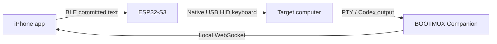

# BOOTMUX Architecture

BOOTMUX is a physical bootstrap interface for a computer whose normal AI, SSH, or remote-development path is not ready.

This document separates the **implemented Build Week slice** from the **future product architecture**. Only the current slice is a public implementation claim. Exact evidence boundaries are maintained in the [Claim and Evidence Matrix](submission/CLAIM_EVIDENCE_MATRIX.md).

The complete original product and recovery-system design remains available in [Architecture Blueprint](ARCHITECTURE_BLUEPRINT.md). That blueprint is a design document, not a statement that every illustrated component is implemented.

## Implemented Build Week slice

### Physical input

```text
iPhone committed printable ASCII
→ Bluetooth Low Energy
→ ESP32-S3
→ native USB HID keyboard
→ target computer
```

### Independently observed return

```text
target PTY / official Codex CLI
→ BOOTMUX Companion
→ local WebSocket
→ iPhone terminal
```

The two paths are deliberately separate. A BLE or firmware acknowledgement proves only that the bridge accepted an operation. It does not prove that the target processed the command. BOOTMUX presents target output only when it was independently observed through the target-side PTY or Codex process.



## Current components

| Component | Implemented responsibility | Current boundary |
| --- | --- | --- |
| iPhone client | SwiftUI UI, CoreBluetooth input, WebSocket terminal, bounded selectable text | iOS 17+; physical copy/CLEAR acceptance remains pending |
| ESP32-S3 bridge | BMX1 BLE input, bounded reassembly, typed controls, native USB HID | printable US-ANSI ASCII only; no mouse or Unicode HID |
| Companion | Go PTY sessions, bounded queues, fail-closed overflow, observed output, bounded Codex adapter | prototype, not a production administration service |
| Codex path | official CLI installation and bounded one-shot `codex exec` interaction | human-controlled authentication; broader post-bootstrap operation not claimed |
| VM harness | disposable ARM64 Lima environment and bootstrap scripts | declared validation environment, not universal platform support |
| Judge Mode | offline replay plus packaged/live local terminal experience | does not prove physical BLE or USB HID |

## Protocol boundaries

### Companion WebSocket

- terminal endpoint: `/v1/terminal`;
- optional read-only HID Mirror endpoint: `/v1/mirror`;
- Judge Mode endpoint: `/judge`;
- loopback bind by default;
- non-loopback bind requires `-allow-remote` and a trusted external network boundary;
- WebSocket, JSON, input, output, and Codex operations are bounded.

See [Companion Protocol V1](COMPANION_PROTOCOL_V1.md).

### BLE and USB HID

- canonical BLE service and characteristic UUIDs are defined in [BMX1](protocol/BMX1.md);
- operations use versioned `BMX1` frames;
- committed text is batched and reassembled within explicit limits;
- control keys are typed operations;
- duplicate operations are acknowledged without being applied twice;
- STOP and disconnect return the keyboard to a neutral state;
- the Build Week bridge supports printable ASCII only.

## Trust and evidence boundaries

Current implementation rules:

1. sent input is not observed output;
2. Judge Replay is not physical evidence;
3. unit tests are not real-device acceptance;
4. private credentials, endpoints, account data, device identifiers, and the `/feedback` Session ID are not committed;
5. authentication remains human-controlled;
6. production readiness and repeatability are not claimed.

## Future product architecture

The following are roadmap goals, not current implementation claims:

- mouse and trackpad input;
- a full USB data return path through ESP32-S3;
- richer terminal emulation;
- automated event classification;
- Context and Recovery Capsules;
- a deterministic policy gate and structured executor;
- evidence-verifying recovery workflows;
- target-side long-running agent handoff;
- Wi-Fi, hotspot, proxy, or other recovery routes;
- signed firmware and broader platform packaging.

Any autonomous recovery layer must keep reasoning, approval, execution, and verification separate. It cannot be promoted into the product claim until the policy gate, structured executor, evidence verifier, threat model, and tests exist.

## Current success definition

The current bounded result is:

- the iPhone client and bridge implementation exist;
- bounded physical ASCII BLE and USB HID input was owner-observed;
- the official Codex CLI was installed and authenticated in the declared clean ARM64 VM path;
- direct and Companion Codex probes returned `BOOTMUX_READY`;
- a physical `BOOTMUX_READY` return reached the iPhone;
- repeatability, physical copy/CLEAR, and HID Mirror acceptance remain open.

See [Project Story](PROJECT_STORY.md), [Build Week Status](submission/BUILD_WEEK_STATUS.md), and [Roadmap](ROADMAP.md).